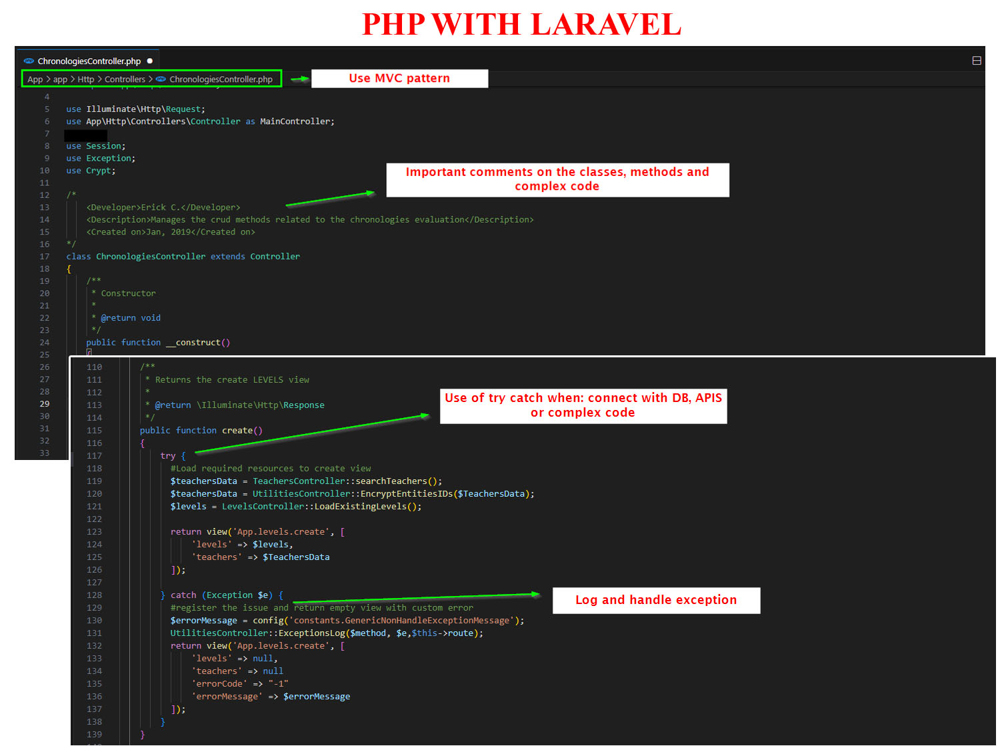

<h1>Back-end development example</h1>

My role: Backend software developer
 

The images are from a test project, but with real development best practices (due confidentiality and security reasons, I won't share live applications code).
Some of the best practices I used to implement:
<ul>
	<li>Good comments (classes, methods, complex code, or API calls)</li>
	<li>Indentation, readable, maintainable, and clear code</li>
	<li>Descriptive variable names</li>
	<li>Error handling</li>
	<li>SOLID principles</li>
	<li>Well-documented code</li>
	<li>Code versioning</li>
	<li>Unit testing</li>
	<li>Pascal and Camel case standarization</li>
</ul>
Main backend languages: C#, Python, PHP
 
I'm excited about learning new technologies or languages.

Skills and tools:
 

	SQL, Database, Relational database, Database design, Database management

 
 
 
