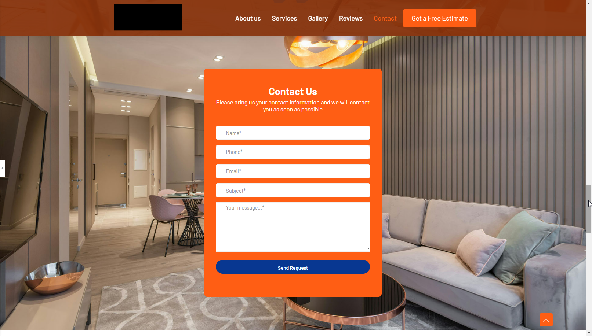

<h1>Wordpress website for construction company (New Jersey, USA)</h1>

My role: Frontend developer
 

Very successful project making a modern web site for a construction company. We selected WordPress, because the client wants a dynamic site that allows them to add/updated content over time.

Steps to make the site as you want:
<ul>
	<li>Initial meeting to know what you want and validate if I can help you.</li>
	<li>Make a proposal solution: structural and graphical.</li>
	<li>Collect info: company info, services, products, etc.</li>
	<li>During development: show advances to be aligned with your expectations</li>
	<li>Optimization: Add SEO, analytics, security and others features</li>
</ul>
Also I can help you with hosting, deployment, etc.

Skills and tools:
 

	WordPress, Website, Web Application, Software Development, Frontend Development

 
 
 
 
